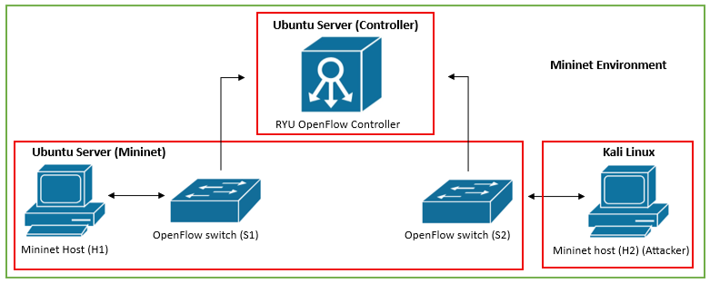
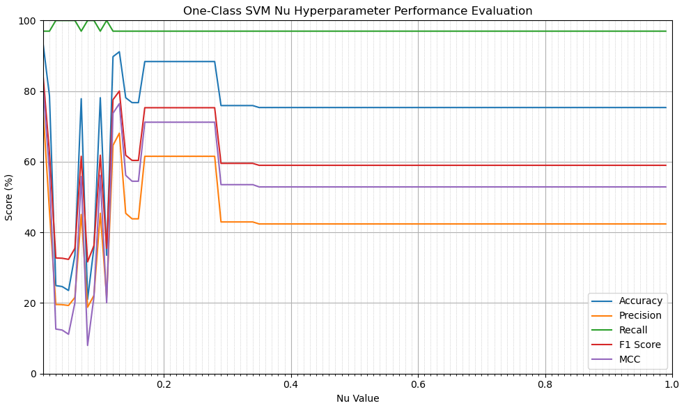
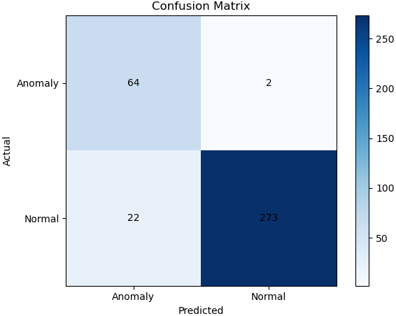
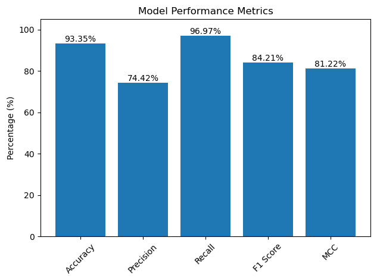
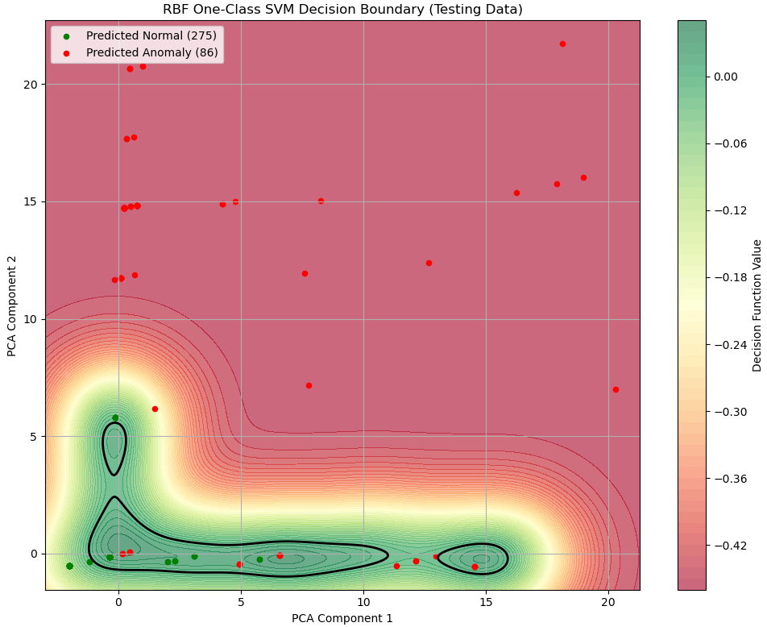
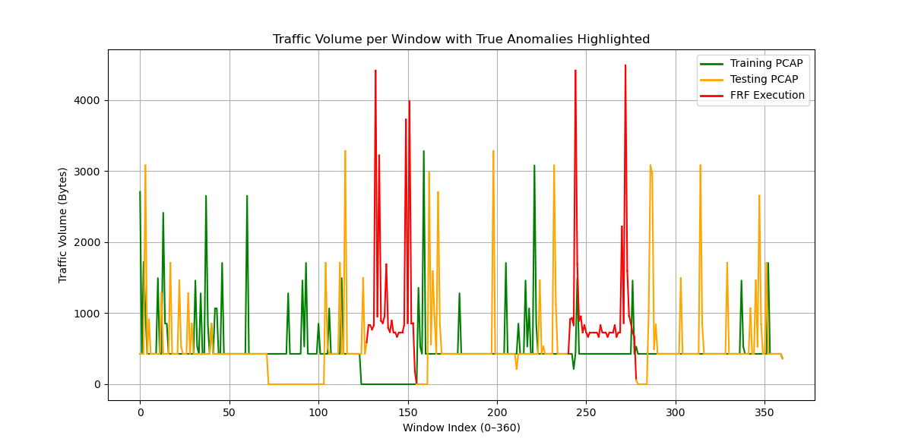
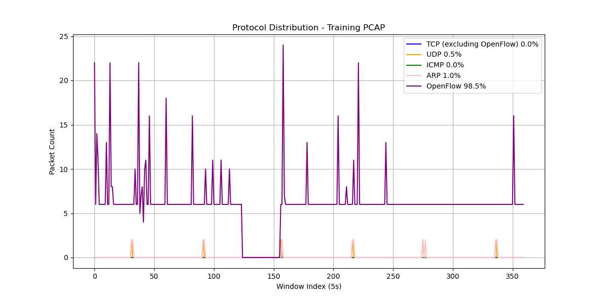
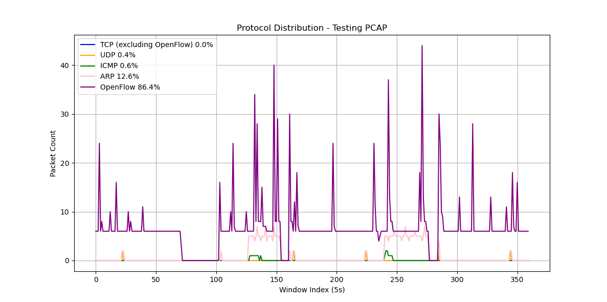
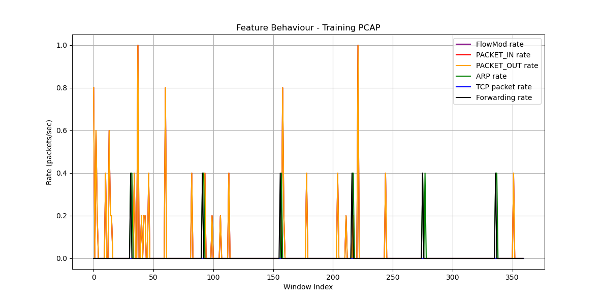
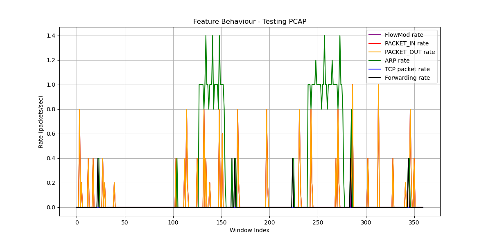

# Results
## Experimental Setup
### Processing Techniques 
* Feature Scaling: Standardisation (Z-Score)
* Feature Selection (Traffic rate): FlowMod, PACKET_IN, PACKET_OUT, ARP, TCP, Forwarding

### Model Configuration (OC-SVM Tuning) 
* Kernel: Radial Basis Function (RBF)
* Gamma: Scale
* Nu: 0.01

### Network Topology

   

## Hyperparameter Analysis (nu) 
- `graphs/show_all_nu.py`:

   

## Model Performance
- `OC-SVM/Testing/test_model.py`:

   

  

## Decision Boundary
- `graphs/decision_boundary.py`:

   

## Dataset Analysis
### Traffic Volume Comparison
- `graphs/traffic_volume_visual.py`:

   

### Protocol Distribution
- `graphs/protocol_distribution_visual.py`:

  

   

## Feature Behaviour
- `graphs/show_features.py`:

   

  

